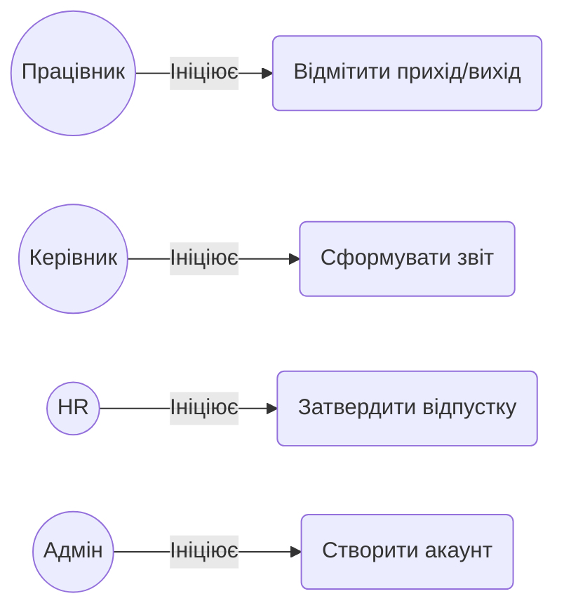

# Розділ 5. Відображення User Stories у UML-нотації

Для реалізації функціональних сценаріїв використовується діаграма прецедентів (Use Case Diagram).

**Актори (Actors):**

- **Employee (Працівник):** звичайний користувач системи.
- **Manager (Керівник відділу):** користувач з правами перегляду статистики відділу.
- **HR (Співробітник відділу кадрів):** користувач з правами управління заявками.
- **Admin (Адміністратор системи):** технічний спеціаліст.

**Прецеденти (Use Cases):**

1. **Відмітити прихід/вихід на роботу (Check-in / Check-out)** — ініціює Employee.
2. **Сформувати звіт по відвідуваності відділу** — ініціює Manager.
3. **Затвердити або відхилити заявку на відпустку** — ініціює HR.
4. **Створити новий обліковий запис працівника** — ініціює Admin.

