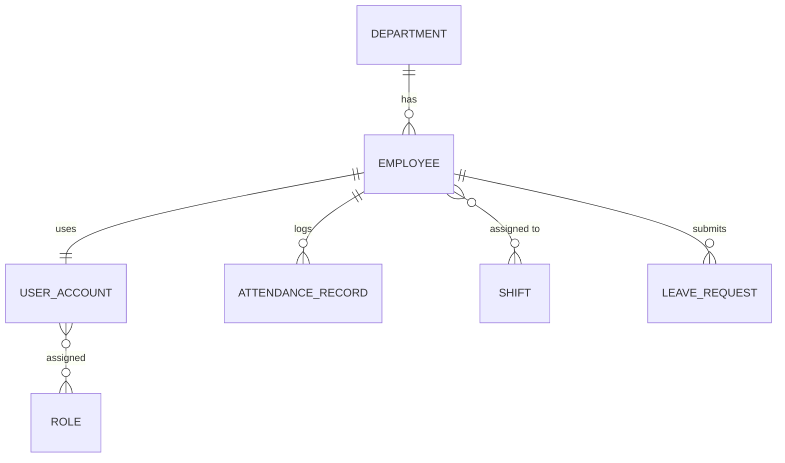

# Розділ 7. Побудова моделі даних

Основною базою даних обрано реляційну СУБД **PostgreSQL**, оскільки дані сильно зв’язані і потрібна цілісність транзакцій (ACID).

## 1. Основні сутності

- `Department` — підрозділ компанії.
- `Employee` — співробітник.
- `UserAccount` — обліковий запис для авторизації.
- `Role` — роль доступу (employee, manager, hr, admin).
- `AttendanceRecord` — відпрацьований інтервал (check-in/check-out).
- `Shift` — зміна/графік.
- `LeaveRequest` — заявка на відпустку.

## 2. Зв’язки між сутностями

- **1:1** `Employee` — `UserAccount` (унікальний зовнішній ключ).
- **1:N** `Department` — `Employee`, `Employee` — `AttendanceRecord`, `Employee` — `LeaveRequest`.
- **M:N** `UserAccount` — `Role` (через місток `UserRole`), `Employee` — `Shift` (через місток `ShiftAssignment`).

## 3. ER-діаграма (спрощена)

